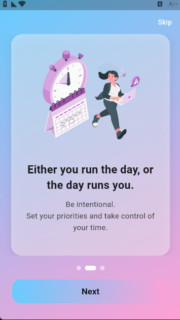
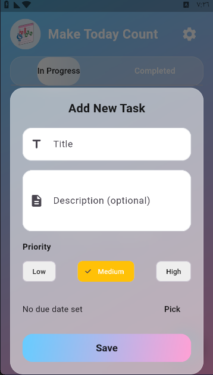
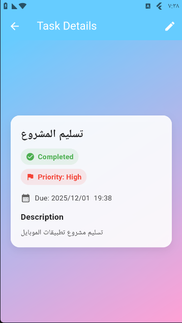
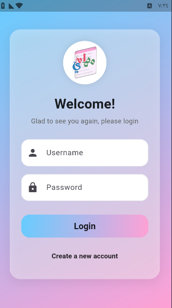
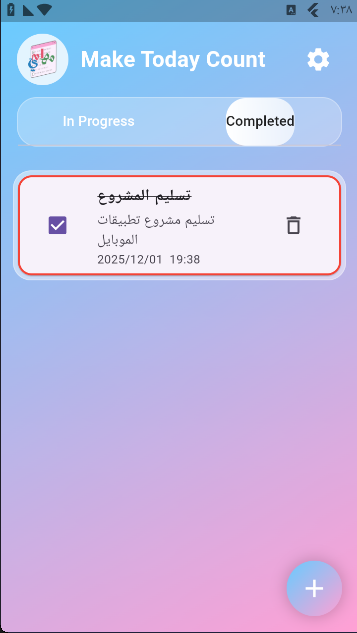

# 📋 Mahami – Task Management App

A modern and efficient task management application built with Flutter.
Mahami helps users stay organized with local data storage, scheduled reminders, and full Arabic (RTL) & English (LTR) support.

The app is structured using clean architecture principles to ensure scalability, maintainability, and separation of concerns.

---

## ✨ Key Features

* 📝 Create, update, and delete tasks
* ⏰ Schedule smart reminders using local notifications
* 💾 Store tasks locally on the device
* 🌍 Full bilingual support (Arabic RTL & English LTR)
* 🎨 Custom theme with Google Fonts
* 📱 Splash screen & onboarding flow
* 🔐 Login & Register UI screens
* ⚙️ Settings management

---

## 🛠️ Tech Stack

* 💙 Flutter
* 📦 Provider (State Management)
* 💾 SharedPreferences (Local Storage)
* 🔔 flutter_local_notifications (Task Reminders)
* 🌍 timezone (Timezone-aware scheduling)
* 🔤 Google Fonts (Custom Typography)

---

## 📂 Project Structure

```
lib/
│
├── models/          # Data models
├── providers/       # State management & business logic
├── screens/         # Application screens (UI pages)
├── widgets/         # Reusable UI components
└── main.dart        # Entry point
```

---

## 🧠 Architecture Overview

The application follows a layered architecture:

* **Models** → Represent application data
* **Providers** → Handle state management & business logic
* **Screens** → UI pages
* **Widgets** → Reusable components

This separation ensures clean code practices and makes the app easier to maintain and extend.

---

## 🚀 Getting Started

### 1️⃣ Clone the repository

```bash
git clone https://github.com/RzanDav/MahamiTaskManager.git
cd mahami
```

### 2️⃣ Install dependencies

```bash
flutter pub get
```

### 3️⃣ Run the application

```bash
flutter run
```

---

## 📸 Screenshots

| Onboarding | Home Active | Add Task |
|-------------|--------------|---------|
|  |  |  |
| Task Details | Login Screen | Home Completed |
|  |  |  |


---

## 🔮 Future Enhancements

* 🌙 Dark Mode
* ☁️ Cloud synchronization
* 📊 Productivity analytics dashboard
* 🔐 Real backend authentication
* 🗂️ Task categories & advanced filters

---

## 👨‍💻 About This Project

This project was developed as part of a core university course to demonstrate:

* Effective state management
* Local data persistence
* Notification scheduling
* Clean folder architecture
* RTL & LTR UI adaptability

---

